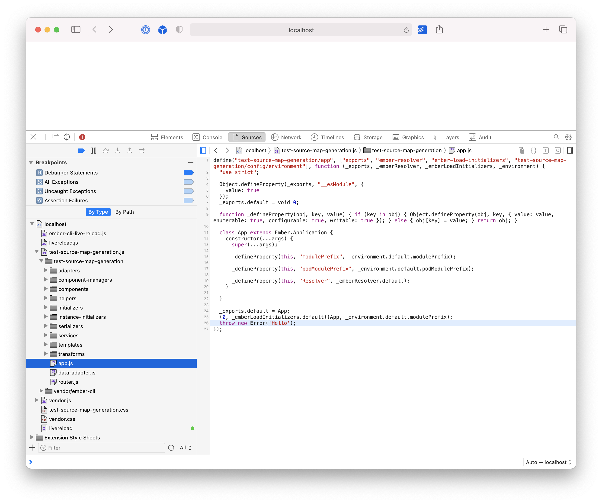
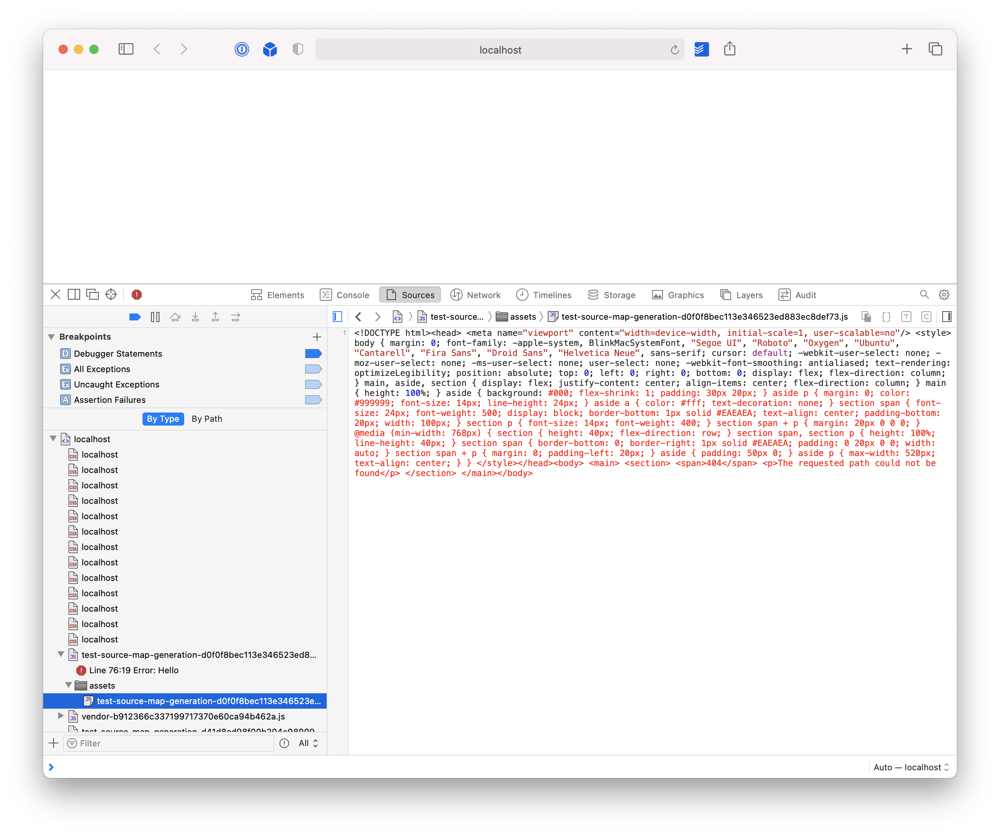

# test-source-map-generation

> Demonstraing a bug in the Ember CLI where fingerprinting and source maps do not work together

## The Problem

The Ember CLI generates invalid source maps when trying to prepend a specific URL during a production build (as you would when using a CDN to host your assets from a different URL than your `index.html`).

By default, the Ember CLI does not generate source maps in Production builds. However, it's common to want to generate them even for your production builds, so they can be uploaded to a service like [Sentry.io](https://sentry.io). This makes tracking down the source of an exception considerably easier.

When using the `fingerprint.prepend` option together with enabling source maps in Production, the generated source maps are not valid. The source maps no longer reference files that actually exist and are, thus, useless.

## The Reproduction

This app is entirely normal with the exception of three things

- the `app.js` file throws an exception after the app is loaded, so that we have an error we can view in the console for the purposes of tracing it to the original file through the source map
- during a production build, the app uses the `fingerprint.prepend` option to hard-code a specific URL to use with your assets, rather than the default behavior which uses a relative path from the domain that you are viewing your `index.html` file from
- source maps are generated even in a Production build (which is not the default)

You need the following to run this reproduction

- The repo, cloned locally
- `npm` (to install dependencies)
- `npx` (to demonstrate the production issue; this should be installed automatically if you have `npm` installed)

### The Correct Behavior (Development)

To start off by viewing the _correct_ behavior, run the app using the normal development process

```bash
npm run start
```

This will start the Ember app. If you view it in your browser and open the JS console, you'll see an exception. If you open it's stack trace, you'll see that it's mapped back to the specific source file (`app.js`) that threw the exception



### The Incorrect Behavior (Production)

To demonstrate the incorrect behavior that's created by the intersection of `fingerprint.prepend` and source map generation, first perform a production build of the app

```bash
npm run build
```

Then, use `npx serve` from the `dist` folder to give you a local file server for our Ember app

```bash
cd dist
npx serve
```

This should start a server on the local port `5000`, which _just so happens_ to match the URL that we have hard-coded using `fingerprint.prepend` in our production builds.

When viewing the exception thrown by the `app.js` file from this server that provides the production version of our app, we _should_ have source maps that lead us back to our original file, just like we have in development. However, that's not the case!



What are even _looking_ at here?

It's the source code for the 404 page provided by the `serve` command.

Why are we looking at it?

The source map is all wrong!

During Development, the `sources` key of the source map object is an array of all of the _actual_ source files on-disk, as it should be. However, during this production build, there's just a single file within the `sources` array:

```
assets/test-source-map-generation-d0f0f8bec113e346523ed883ec8def73.js
```

Which resolves, ultimately, to this full file path

```
http://localhost:5000/assets/assets/test-source-map-generation-d0f0f8bec113e346523ed883ec8def73.js
```

This path doesn't map to actual source files at all, but instead appears to reference the _output_ JS file instead, which is not nearly as useful as referencing the input files as we would expect.

On top of that, the `assets` segment of the URL is repeated; because the source map includes a relative path that begins `./assets`, but the source map itself lives within `/assets`, we end up looking up `./assets` relative to `/assets` which results in the confusing file path listed above.

Thus, our source maps are entirely broken.
